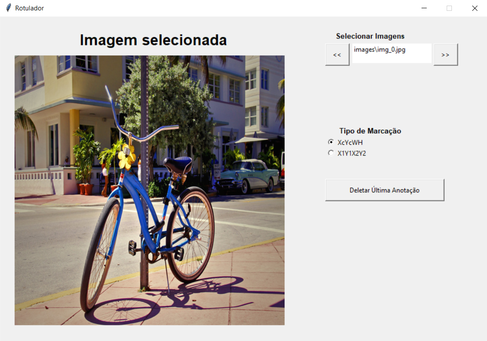

  
  
  
  


# Rotulador-Python

## Objetivo
Este repositório contém um arquivo gui.py que abre uma janela (desenvolvida em python, utilizando a biblioteca [Tkinter](https://docs.python.org/3/library/tkinter.html)).  
Serve para auxiliar na tarefa de rotulação de objetos para ser utilizada em detecções de objetos em imagens através de redes neurais. 

## Execução
Executar o simples comando para abrir a janela:   
```python gui.py```  
Será aberta uma tela, conforme exibido abaixo:  
  
fonte da figura da bicicleta exibida: [https://flickr.com/photos/rafavacaserrano](https://flickr.com/photos/rafavacaserrano/3952921229/in/photolist-72iKLi-c3dros-vHDnaK-dm61zz-6hQi7r-dm66qQ-aHoSzX-5mW7BN-6WqpLw-bxNpns-iwnMuV-T3U1dV-2jp1tHa-2kWLRnw-ZApY8N-sFj3a-bDA8th-FjygaQ-7FBqY7-nrtSzK-BZ7Wy7-afgph6-gWjB1h-7BydLp-hWath-2hkRToL-7NYJQF-b4Nr9p-nNQvfy-f2AYd8-22eHykE-UZGa63-oNH11A-fMDMWg-fMFgfP-rdp7RD-cijgjs-59JAqi-9bz79a-dcaCAx-5XRL2z-qfB7Ls-dctJNe-257CBg8-2jPvBzc-6i1nY3-2m79eW7-GJhujA-bmJQ1R-TtvjQ8)

## Anotações
- As anotações são realizadas e salvas no arquivo ```annotations.csv``` que é salvo na mesma raiz do arquivo ```gui.py```. 
- O formato é o seguinte:  
```img_path,imgw,imgh,ind_classe,xc,yc,w,h```
- Onde xc, w são relativos à imgw (Largura da imagem) e yc, h são relativos à imgh (Algura da imagem).
- ```ind_classe``` representa o índice, número ou letra da classe que você digitar na hora da anotação. Caso não digite nada, não é salva anotação.
- Caso o tipo de marcação esteja em "XcYcWH", então deve-se clicar inicialmente no centro do objeto e depois ajustar o retângulo que será desenhado até as bordas do objeto.  
- Caso o tipo de marcação esteja em "X1Y1X2Y2", então deve-se escolher o ponto inicial (Topo Esquerdo) até o ponto final (Inferior Direito) de forma a deixar o retângulo ajustado. 
- **No meio do ajuste do retângulo, pode-se clicar no botão esquerdo do mouse para cancelar a marcação atual.**
- Por fim, a cada marcação salva, é feita uma atualização dos ```bboxes``` em verde. A anotação também é salva no arquivo na mesma hora. Um exemplo é o seguinte:   


## Restrições

- É necessário ter um diretório na mesma raiz do ```gui.py``` chamada de ```images``` com todas as imagens para realizar a tarefa de rotular os objetos.  
- Todas as imagens são redimensionadas apenas para caber dentro da janela. Não são em nenhum momento redimensionadas no próprio diretório.
